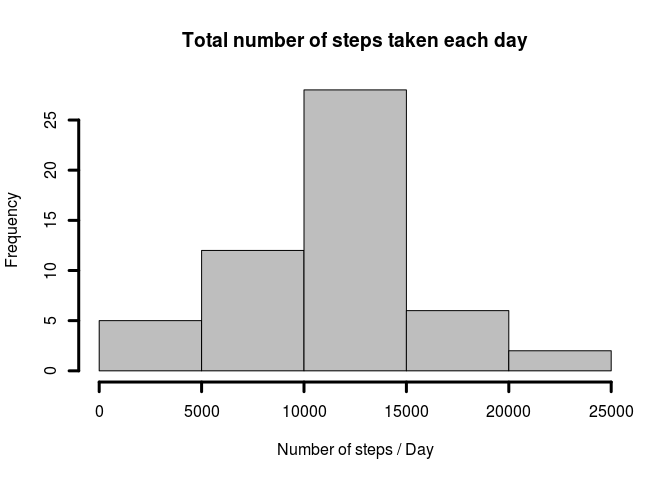
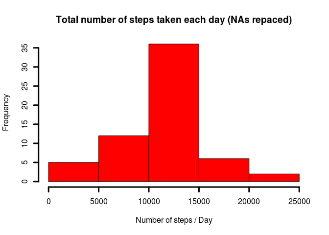

# Reproducible Research: Peer Assessment 1
MC  
13/12/2014  
## Introduction

It is now possible to collect a large amount of data about personal
movement using activity monitoring devices such as a
[Fitbit](http://www.fitbit.com), [Nike
Fuelband](http://www.nike.com/us/en_us/c/nikeplus-fuelband), or
[Jawbone Up](https://jawbone.com/up). These type of devices are part of
the "quantified self" movement -- a group of enthusiasts who take
measurements about themselves regularly to improve their health, to
find patterns in their behavior, or because they are tech geeks. But
these data remain under-utilized both because the raw data are hard to
obtain and there is a lack of statistical methods and software for
processing and interpreting the data.

## Assignment
### Loading and preprocessing the data
This assignment makes use of data from a personal activity monitoring
device. This device collects data at 5 minute intervals through out the
day. The data consists of two months of data from an anonymous
individual collected during the months of October and November, 2012
and include the number of steps taken in 5 minute intervals each day.

### Working Directory
First step is to set the current working directory.

```r
#Set current work directory
setwd('/media/cara-marti/Data/Coursera/05_Reproducible_Research/Projects/PA1')
```
### Libraries
In the code following libraries were used:  
1. `data.table`  
2. `lubridate`  
3. `lattice`  
4. `knitr`


```r
#Load the required packages
library(data.table)
library(lubridate)
library(lattice)
library(knitr)
opts_chunk$set(cache=TRUE, fig.align='center')
```

To avoid problems with time zones, the system was set to US time.

```r
Sys.setlocale("LC_TIME", "en_US.UTF-8")
```

### Data
The data for this assignment can be downloaded from the course web
site:

* Dataset: [Activity monitoring data](https://d396qusza40orc.cloudfront.net/repdata%2Fdata%2Factivity.zip) [52K]

First, you have to check if the folder you want to put the data in exists:

```r
#Check that data folder exists
if (!file.exists('source_data')) {
  dir.create('source_data')
}
```
Then you control if the data set has already been downloaded and unzipped, if not you get it from the link

```r
#Check if data set exists, if not create it from downloaded and unzipped file
if (!file.exists('source_data/activity.csv')) {
  file.url <- 'https://d396qusza40orc.cloudfront.net/repdata%2Fdata%2Factivity.zip'
  download.file(file.url, destfile = 'source_data/Activity_Monitoring.zip', method='wget')
  unzip('source_data/Activity_Monitoring.zip', exdir = 'source_data', overwrite = TRUE)
}
```

The variables included in this dataset are:

* **steps**: Number of steps taking in a 5-minute interval (missing
    values are coded as `NA`)

* **date**: The date on which the measurement was taken in YYYY-MM-DD
    format

* **interval**: Identifier for the 5-minute interval in which
    measurement was taken

The dataset is stored in a comma-separated-value (CSV) file and there
are a total of 17,568 observations in this dataset.

So you read the table into a dataframe and define the column names

```r
#Read table
Activity<-read.table('source_data/activity.csv',header=TRUE, sep=',')
  
#Define column names
cols<-c('steps', 'date', 'interval')
colnames(Activity)<-cols
```

### What is mean total number of steps taken per day?

1. Make a histogram of the total number of steps taken each day

```r
TotalSteps <- aggregate(steps ~ date, data = Activity, sum, na.rm=T)
hist(TotalSteps$steps, main = 'Total number of steps taken each day', xlab = 'Number of steps / Day', col = 'grey', lwd = 3)
```


2. Calculate and report the **mean** and **median** total number of steps taken per day

```r
Steps_Mean <- mean(TotalSteps$steps)
Steps_Mean
```

```
## [1] 10766.19
```

```r
Steps_Median <- median(TotalSteps$steps)
Steps_Median
```

```
## [1] 10765
```

### What is the average daily activity pattern?

1. Make a time series plot (i.e. `type = "l"`) of the 5-minute interval (x-axis) and the average number of steps taken, averaged across all days (y-axis)

```r
Steps_Interval <- aggregate(steps ~ interval, data = Activity, mean, na.rm=T)
plot(steps ~ interval, data = Steps_Interval, type = 'l', xlab = '5-minute Interval', ylab = 'Average number of steps taken', main = 'Average number of steps taken at 5-minute intervals', lwd = 2)
```


2. Which 5-minute interval, on average across all the days in the dataset, contains the maximum number of steps?

```r
Max_Step_Interval <- Steps_Interval[which.max(Steps_Interval$steps),"interval"]
Max_Step_Interval
```

```
## [1] 835
```

### Imputing missing values

Note that there are a number of days/intervals where there are missing values (coded as `NA`). The presence of missing days may introduce bias into some calculations or summaries of the data.

1. Calculate and report the total number of missing values in the dataset (i.e. the total number of rows with `NA`s)

```r
NA_rows <- sum(!complete.cases(Activity))
NA_rows
```

```
## [1] 2304
```

2. Create a new dataset that is equal to the original dataset but with the missing data filled in.

```r
CompleteActivity <- Activity
```

3. Devise a strategy for filling in all of the missing values in the dataset. The strategy does not need to be sophisticated. For example, you could use the mean/median for that day, or the mean for that 5-minute interval, etc.


In this case the mean of the corresponding 5-minute interval during the days in which the values have been recorded has been used.

```r
GetStepsPerInterval <- function(Interval){
  Steps_Interval[Steps_Interval$interval==Interval,"steps"]
}

for (n in 1:nrow(CompleteActivity)) {
  if (is.na(CompleteActivity[n,"steps"])) {
    CompleteActivity[n,"steps"] <- GetStepsPerInterval(CompleteActivity[n,"interval"])
  }
}
```

4. Make a histogram of the total number of steps taken each day and Calculate and report the **mean** and **median** total number of steps taken per day. Do these values differ from the estimates from the first part of the assignment? What is the impact of imputing missing data on the estimates of the total daily number of steps?

```r
CompleteTotalSteps <- aggregate(steps ~ date, data = CompleteActivity, sum, na.rm=T)
hist(CompleteTotalSteps$steps, main = 'Total number of steps taken each day (NAs repaced)', xlab = 'Number of steps / Day', col = 'red', lwd = 3)
```



```r
CompleteSteps_Mean <- mean(CompleteTotalSteps$steps)
CompleteSteps_Mean
```

```
## [1] 10766.19
```

```r
CompleteSteps_Median <- median(CompleteTotalSteps$steps)
CompleteSteps_Median
```

```
## [1] 10766.19
```
While the **mean** value is the same as the value before inputing the missing data, the **median** value has changed.  
Since the **mean** values have been used to fill the missing `NA` values, the total **mean** value has not changed, while the **median** has moved closer to the **mean** value.

### Are there differences in activity patterns between weekdays and weekends?
1. Create a new factor variable in the dataset with two levels -- "weekday" and "weekend" indicating whether a given date is a weekday or weekend day.

```r
CompleteActivity$Weekdays <- ifelse(as.POSIXlt(as.Date(CompleteActivity$date))$wday%%6 == 0, "weekend", "weekday")
CompleteActivity$Weekdays <- factor(CompleteActivity$Weekdays, levels = c("weekday", "weekend"))
```

2. Make a panel plot containing a time series plot (i.e. `type = "l"`) of the 5-minute interval (x-axis) and the average number of steps taken, averaged across all weekday days or weekend days (y-axis).

```r
stepsWD= aggregate(steps ~ interval + Weekdays, CompleteActivity, mean)
xyplot(steps ~ interval | factor(Weekdays), data = stepsWD, aspect = 1/2, type = "l")
```


